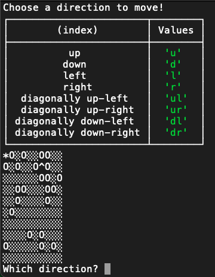

# Find Your Hat! - a Terminal Game

Oh no! You left your hat behind in the field! You'll have to go back for it. Be careful of all the holes!

## Installation:

Clone this repo to play the game:

    git clone https://github.com/sierragreen379/Find_Your_Hat.git

Navigate to the repo, and then type:

    node main.js

That'll start the game! Once you finish a game, you'll have to enter the last command to start a new game.

**Tools Used:** plain old Node.js